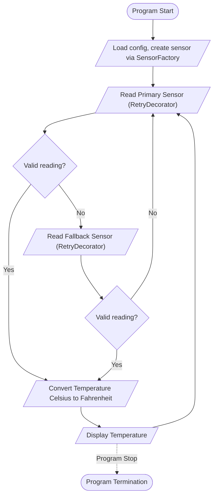

```mermaid
flowchart TD

start([Program Start])
A1[/"Load config, create sensor via SensorFactory"/]
A2[/"Read Primary Sensor (RetryDecorator)"/]
D1{Valid reading?}
A4[/"Read Fallback Sensor (RetryDecorator)"/]
D2{Valid reading?}
A3[/"Convert Temperature Celsius to Fahrenheit"/]
A5[/"Display Temperature"/]
stop([Program Termination])

start --> A1
A1 --> A2
A2 --> D1
D1 -- Yes --> A3
D1 -- No --> A4
A4 --> D2
D2 -- Yes --> A3
D2 -- No --> A2
A3 --> A5
A5 --> A2
A5 -. Program Stop .-> stop
```
