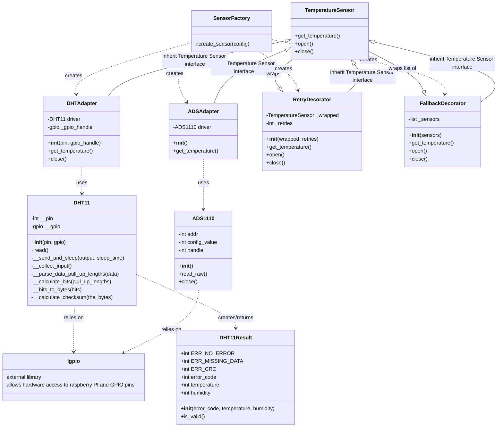

```mermaid
 classDiagram
    class TemperatureSensor {
        +get_temperature()
        +open()
        +close()
    }

    class ADSAdapter {
        -ADS1110 driver
        +__init__()
        +get_temperature()
    }

    class DHTAdapter {
        -DHT11 driver
        -gpio _gpio_handle
        +__init__(pin, gpio_handle)
        +get_temperature()
        +close()
    }

    class RetryDecorator {
        -TemperatureSensor _wrapped
        -int _retries
        +__init__(wrapped, retries)
        +get_temperature()
        +open()
        +close()
    }

    class FallbackDecorator {
        -list _sensors
        +__init__(sensors)
        +get_temperature()
        +open()
        +close()
    }

    class SensorFactory {
        +create_sensor(config)$
    }

    class ADS1110 {
        -int addr
        -int config_value
        -int handle
        +__init__()
        +read_raw()
        +close()
    }

    class DHT11 {
        -int __pin
        -gpio __gpio
        +__init__(pin, gpio)
        +read()
        -__send_and_sleep(output, sleep_time)
        -__collect_input()
        -__parse_data_pull_up_lengths(data)
        -__calculate_bits(pull_up_lengths)
        -__bits_to_bytes(bits)
        -__calculate_checksum(the_bytes)
    }

    class DHT11Result {
        +int ERR_NO_ERROR
        +int ERR_MISSING_DATA
        +int ERR_CRC
        +int error_code
        +int temperature
        +int humidity
        +__init__(error_code, temperature, humidity)
        +is_valid()
    }

    %% Not entirely sure how to show this, as its not a class but essential to this project to get readings
    class lgpio {
        external library
        allows hardware access to raspberry PI and GPIO pins
    }

    %% So basically get_temperature in TemperatureSensor is just an interface to show how the function should look in ADSAdapter, DHTAdapter, and now the decorators too
    TemperatureSensor <|-- ADSAdapter : inherit Temperature Sensor interface
    TemperatureSensor <|-- DHTAdapter : inherit Temperature Sensor interface
    TemperatureSensor <|-- RetryDecorator : inherit Temperature Sensor interface
    TemperatureSensor <|-- FallbackDecorator : inherit Temperature Sensor interface

    RetryDecorator <|-- TemperatureSensor : wraps
    FallbackDecorator <|-- TemperatureSensor : wraps list of

    SensorFactory ..> FallbackDecorator : creates
    SensorFactory ..> RetryDecorator : creates
    SensorFactory ..> ADSAdapter : creates
    SensorFactory ..> DHTAdapter : creates

    ADSAdapter ..> ADS1110 : uses
    DHTAdapter ..> DHT11 : uses

    ADS1110 ..> lgpio : relies on
    DHT11 ..> lgpio : relies on

    DHT11 ..> DHT11Result : creates/returns
```
