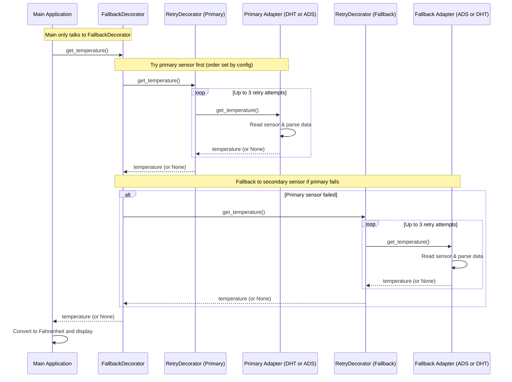

```mermaid
sequenceDiagram
    participant Main as Main Application
    participant FallbackDecorator as FallbackDecorator
    participant RetryA as RetryDecorator (Primary)
    participant PrimaryAdapter as Primary Adapter (DHT or ADS)
    participant RetryB as RetryDecorator (Fallback)
    participant FallbackAdapter as Fallback Adapter (ADS or DHT)

    %% Main just calls the top of the decorator stack
    Note over Main,FallbackDecorator: Main only talks to FallbackDecorator
    Main->>FallbackDecorator: get_temperature()

    %% FallbackDecorator tries primary first
    Note over FallbackDecorator,PrimaryAdapter: Try primary sensor first (order set by config)
    FallbackDecorator->>RetryA: get_temperature()

    loop Up to 3 retry attempts
        RetryA->>PrimaryAdapter: get_temperature()
        PrimaryAdapter->>PrimaryAdapter: Read sensor & parse data
        PrimaryAdapter-->>RetryA: temperature (or None)
    end

    RetryA-->>FallbackDecorator: temperature (or None)

    %% ALT block for if primary fails, fallback to secondary
    Note over FallbackDecorator,FallbackAdapter: Fallback to secondary sensor if primary fails
    alt Primary sensor failed
        FallbackDecorator->>RetryB: get_temperature()

        loop Up to 3 retry attempts
            RetryB->>FallbackAdapter: get_temperature()
            FallbackAdapter->>FallbackAdapter: Read sensor & parse data
            FallbackAdapter-->>RetryB: temperature (or None)
        end

        RetryB-->>FallbackDecorator: temperature (or None)
    end

    FallbackDecorator-->>Main: temperature (or None)

    %% Same as before, outside of alt block so both paths hit this
    Main->>Main: Convert to Fahrenheit and display
```
