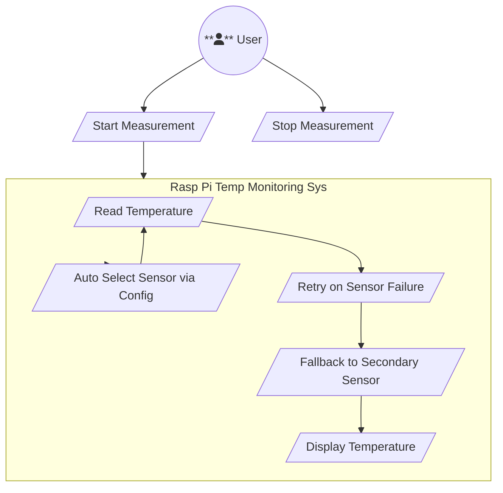

```mermaid
flowchart TD
    USER(("**fa:fa-user** User"))

    subgraph SYS["Rasp Pi Temp Monitoring Sys"]
        UC1[/"Read Temperature"/]
        UC2[/"Auto Select Sensor via Config"/]
        UC3[/"Display Temperature"/]
        UC4[/"Retry on Sensor Failure"/]
        UC5[/"Fallback to Secondary Sensor"/]
    end

    UC0[/"Start Measurement"/]
    UC6[/"Stop Measurement"/]

    %% Relations
    USER --> UC0
    USER --> UC6
    UC0 --> SYS
    SYS --> UC2
    UC2 --> UC1
    UC1 --> UC4
    UC4 --> UC5
    UC5 --> UC3
```
