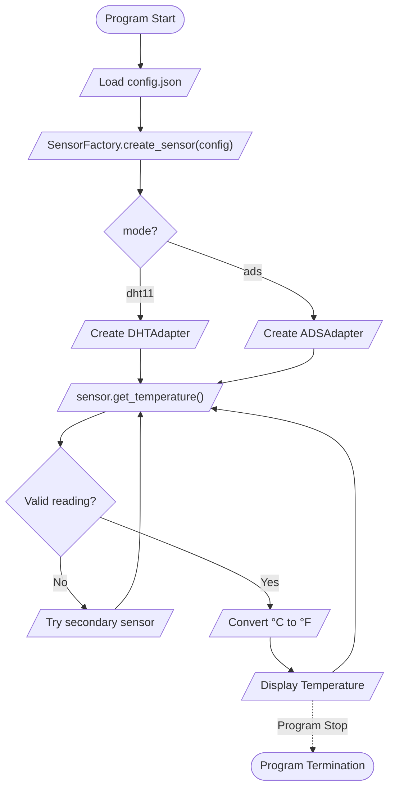

```mermaid
flowchart TD

start([Program Start])
A0[/"Load config.json"/]
A1[/"SensorFactory.create_sensor(config)"/]
D0{mode?}
F1[/"Create DHTAdapter"/]
F2[/"Create ADSAdapter"/]
A3[/"sensor.get_temperature()"/]
D1{Valid reading?}
A4[/"Try secondary sensor"/]
A5[/"Convert °C to °F"/]
A6[/"Display Temperature"/]
stop([Program Termination])

start --> A0
A0 --> A1
A1 --> D0
D0 -- dht11 --> F1
D0 -- ads --> F2
F1 --> A3
F2 --> A3
A3 --> D1
D1 -- Yes --> A5
D1 -- No --> A4
A4 --> A3
A5 --> A6
A6 --> A3
A6 -. Program Stop .-> stop


```
