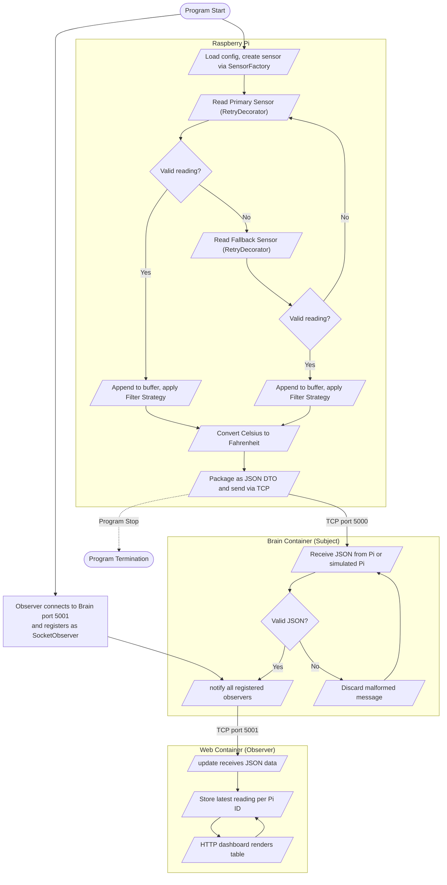

```mermaid
flowchart TD

start([Program Start])

subgraph PI ["Raspberry Pi"]
  A1[/"Load config, create sensor via SensorFactory"/]
  A2[/"Read Primary Sensor (RetryDecorator)"/]
  D1{Valid reading?}
  S1[/"Append to buffer, apply Filter Strategy"/]
  A4[/"Read Fallback Sensor (RetryDecorator)"/]
  D2{Valid reading?}
  S2[/"Append to buffer, apply Filter Strategy"/]
  A3[/"Convert Celsius to Fahrenheit"/]
  SEND[/"Package as JSON DTO and send via TCP"/]
end

subgraph BRAIN ["Brain Container (Subject)"]
  RECV[/"Receive JSON from Pi or simulated Pi"/]
  PARSE{Valid JSON?}
  NOTIFY[/"notify all registered observers"/]
  DISCARD[/"Discard malformed message"/]
end

subgraph WEB ["Web Container (Observer)"]
  UPDATE[/"update receives JSON data"/]
  STORE[/"Store latest reading per Pi ID"/]
  DISPLAY[/"HTTP dashboard renders table"/]
end

CONNPI["Observer connects to Brain port 5001\nand registers as SocketObserver"]
stop([Program Termination])

start --> A1
start --> CONNPI
CONNPI --> NOTIFY

A1 --> A2
A2 --> D1
D1 -- Yes --> S1
D1 -- No --> A4
S1 --> A3
A4 --> D2
D2 -- Yes --> S2
D2 -- No --> A2
S2 --> A3
A3 --> SEND

SEND -->|TCP port 5000| RECV
RECV --> PARSE
PARSE -- Yes --> NOTIFY
PARSE -- No --> DISCARD
DISCARD --> RECV

NOTIFY -->|TCP port 5001| UPDATE
UPDATE --> STORE
STORE --> DISPLAY
DISPLAY --> STORE

SEND -. Program Stop .-> stop
```
