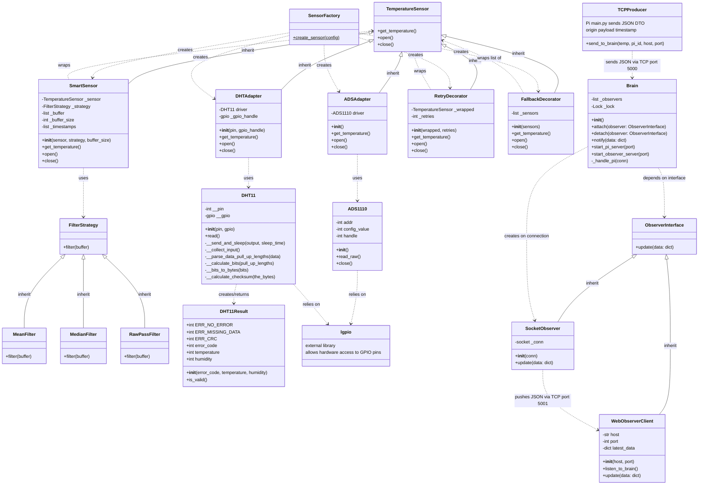

```mermaid
classDiagram

    %% Sensor layer
    class TemperatureSensor {
        +get_temperature()
        +open()
        +close()
    }

    class ADSAdapter {
        -ADS1110 driver
        +__init__()
        +get_temperature()
        +open()
        +close()
    }

    class DHTAdapter {
        -DHT11 driver
        -gpio _gpio_handle
        +__init__(pin, gpio_handle)
        +get_temperature()
        +open()
        +close()
    }

    class SmartSensor {
        -TemperatureSensor _sensor
        -FilterStrategy _strategy
        -list _buffer
        -int _buffer_size
        -list _timestamps
        +__init__(sensor, strategy, buffer_size)
        +get_temperature()
        +open()
        +close()
    }

    class FilterStrategy {
        +filter(buffer)
    }

    class MeanFilter {
        +filter(buffer)
    }

    class MedianFilter {
        +filter(buffer)
    }

    class RawPassFilter {
        +filter(buffer)
    }

    class RetryDecorator {
        -TemperatureSensor _wrapped
        -int _retries
        +__init__(wrapped, retries)
        +get_temperature()
        +open()
        +close()
    }

    class FallbackDecorator {
        -list _sensors
        +__init__(sensors)
        +get_temperature()
        +open()
        +close()
    }

    class SensorFactory {
        +create_sensor(config)$
    }

    class ADS1110 {
        -int addr
        -int config_value
        -int handle
        +__init__()
        +read_raw()
        +close()
    }

    class DHT11 {
        -int __pin
        -gpio __gpio
        +__init__(pin, gpio)
        +read()
        -__send_and_sleep(output, sleep_time)
        -__collect_input()
        -__parse_data_pull_up_lengths(data)
        -__calculate_bits(pull_up_lengths)
        -__bits_to_bytes(bits)
        -__calculate_checksum(the_bytes)
    }

    class DHT11Result {
        +int ERR_NO_ERROR
        +int ERR_MISSING_DATA
        +int ERR_CRC
        +int error_code
        +int temperature
        +int humidity
        +__init__(error_code, temperature, humidity)
        +is_valid()
    }

    class lgpio {
        external library
        allows hardware access to GPIO pins
    }

    %%  Observer / Networking layer

    class ObserverInterface {
        +update(data: dict)
    }

    class Brain {
        -list _observers
        -Lock _lock
        +__init__()
        +attach(observer: ObserverInterface)
        +detach(observer: ObserverInterface)
        +notify(data: dict)
        +start_pi_server(port)
        +start_observer_server(port)
        -_handle_pi(conn)
    }

    class SocketObserver {
        -socket _conn
        +__init__(conn)
        +update(data: dict)
    }

    class WebObserverClient {
        -str host
        -int port
        -dict latest_data
        +__init__(host, port)
        +listen_to_brain()
        +update(data: dict)
    }

    class TCPProducer {
        Pi main.py sends JSON DTO
        origin payload timestamp
        +send_to_brain(temp, pi_id, host, port)
    }

    %% Sensor inheritance
    TemperatureSensor <|-- ADSAdapter : inherit
    TemperatureSensor <|-- DHTAdapter : inherit
    TemperatureSensor <|-- SmartSensor : inherit
    TemperatureSensor <|-- RetryDecorator : inherit
    TemperatureSensor <|-- FallbackDecorator : inherit

    RetryDecorator ..> TemperatureSensor : wraps
    FallbackDecorator ..> TemperatureSensor : wraps list of

    FilterStrategy <|-- MeanFilter : inherit
    FilterStrategy <|-- MedianFilter : inherit
    FilterStrategy <|-- RawPassFilter : inherit

    SmartSensor ..> FilterStrategy : uses
    SmartSensor ..> TemperatureSensor : wraps

    SensorFactory ..> FallbackDecorator : creates
    SensorFactory ..> RetryDecorator : creates
    SensorFactory ..> SmartSensor : creates
    SensorFactory ..> ADSAdapter : creates
    SensorFactory ..> DHTAdapter : creates

    ADSAdapter ..> ADS1110 : uses
    DHTAdapter ..> DHT11 : uses

    ADS1110 ..> lgpio : relies on
    DHT11 ..> lgpio : relies on
    DHT11 ..> DHT11Result : creates/returns

    %% Observer inheritance
    ObserverInterface <|-- SocketObserver : inherit
    ObserverInterface <|-- WebObserverClient : inherit

    Brain ..> ObserverInterface : depends on interface
    Brain ..> SocketObserver : creates on connection
    TCPProducer ..> Brain : sends JSON via TCP port 5000
    SocketObserver ..> WebObserverClient : pushes JSON via TCP port 5001
```
