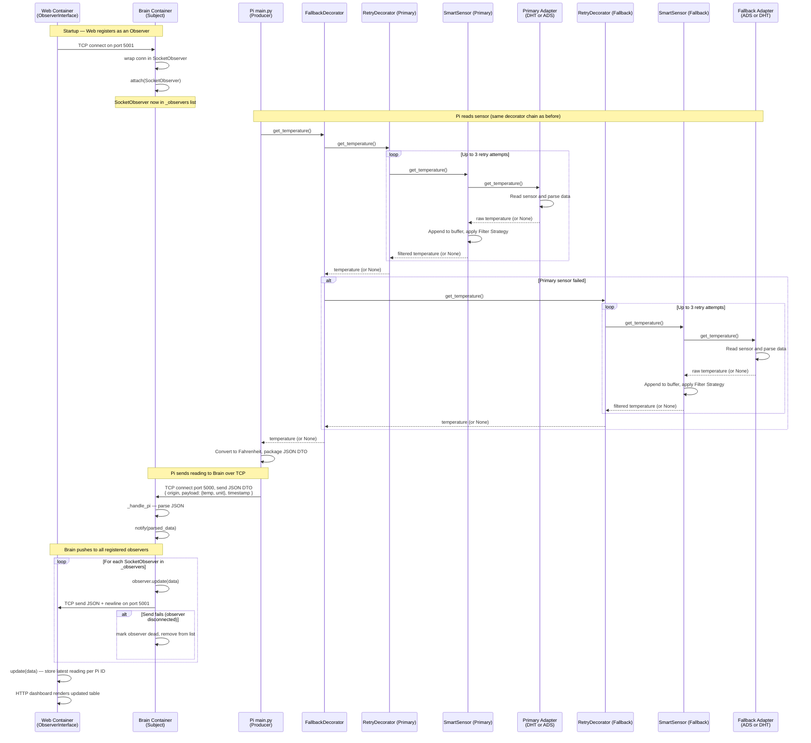

```mermaid
sequenceDiagram
    participant Web as Web Container<br/>(ObserverInterface)
    participant Brain as Brain Container<br/>(Subject)
    participant Main as Pi main.py<br/>(Producer)
    participant FD as FallbackDecorator
    participant RetryA as RetryDecorator (Primary)
    participant SmartA as SmartSensor (Primary)
    participant PrimaryAdapter as Primary Adapter<br/>(DHT or ADS)
    participant RetryB as RetryDecorator (Fallback)
    participant SmartB as SmartSensor (Fallback)
    participant FallbackAdapter as Fallback Adapter<br/>(ADS or DHT)

    Note over Web,Brain: Startup — Web registers as an Observer

    Web->>Brain: TCP connect on port 5001
    Brain->>Brain: wrap conn in SocketObserver
    Brain->>Brain: attach(SocketObserver)
    Note over Brain: SocketObserver now in _observers list

    Note over Main,FallbackAdapter: Pi reads sensor (same decorator chain as before)

    Main->>FD: get_temperature()
    FD->>RetryA: get_temperature()

    loop Up to 3 retry attempts
        RetryA->>SmartA: get_temperature()
        SmartA->>PrimaryAdapter: get_temperature()
        PrimaryAdapter->>PrimaryAdapter: Read sensor and parse data
        PrimaryAdapter-->>SmartA: raw temperature (or None)
        SmartA->>SmartA: Append to buffer, apply Filter Strategy
        SmartA-->>RetryA: filtered temperature (or None)
    end

    RetryA-->>FD: temperature (or None)

    alt Primary sensor failed
        FD->>RetryB: get_temperature()

        loop Up to 3 retry attempts
            RetryB->>SmartB: get_temperature()
            SmartB->>FallbackAdapter: get_temperature()
            FallbackAdapter->>FallbackAdapter: Read sensor and parse data
            FallbackAdapter-->>SmartB: raw temperature (or None)
            SmartB->>SmartB: Append to buffer, apply Filter Strategy
            SmartB-->>RetryB: filtered temperature (or None)
        end

        RetryB-->>FD: temperature (or None)
    end

    FD-->>Main: temperature (or None)
    Main->>Main: Convert to Fahrenheit, package JSON DTO

    Note over Main,Brain: Pi sends reading to Brain over TCP

    Main->>Brain: TCP connect port 5000, send JSON DTO<br/>{ origin, payload: {temp, unit}, timestamp }
    Brain->>Brain: _handle_pi — parse JSON
    Brain->>Brain: notify(parsed_data)

    Note over Brain,Web: Brain pushes to all registered observers

    loop For each SocketObserver in _observers
        Brain->>Brain: observer.update(data)
        Brain->>Web: TCP send JSON + newline on port 5001
        alt Send fails (observer disconnected)
            Brain->>Brain: mark observer dead, remove from list
        end
    end

    Web->>Web: update(data) — store latest reading per Pi ID
    Web->>Web: HTTP dashboard renders updated table
```
