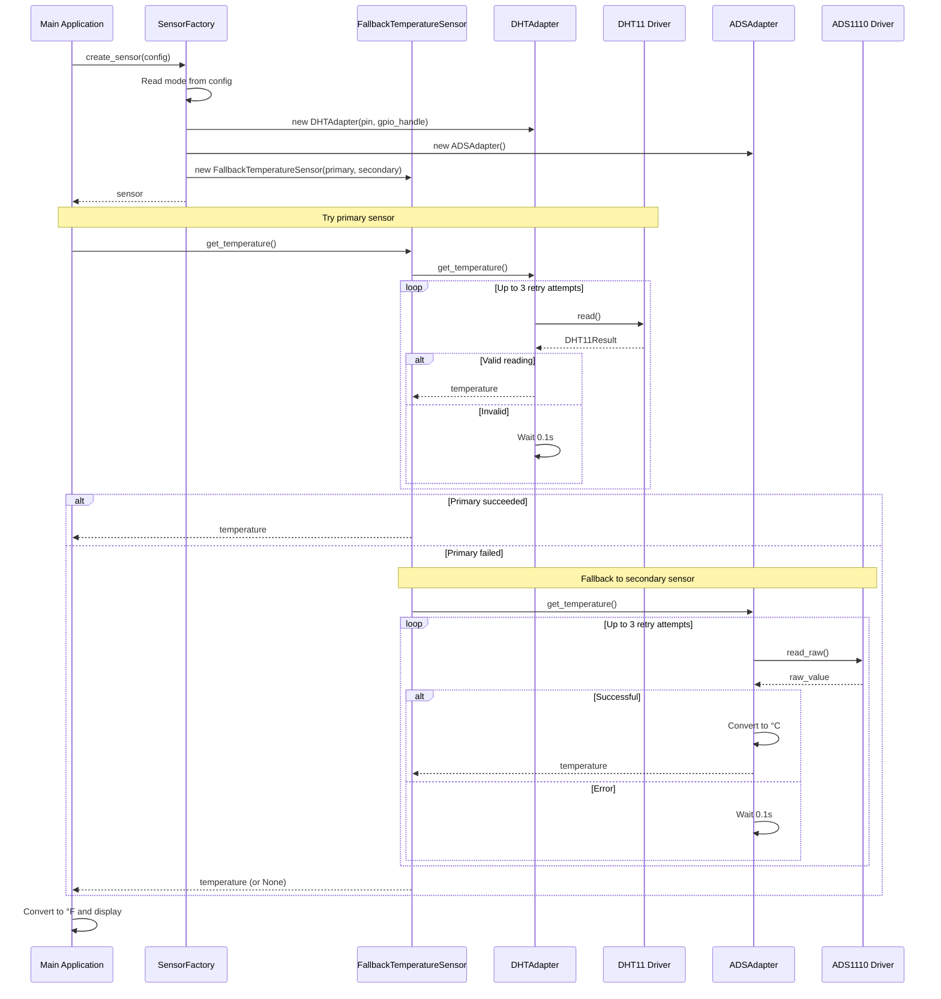

```mermaid
sequenceDiagram
    participant Main as Main Application
    participant Factory as SensorFactory
    participant Fallback as FallbackTemperatureSensor
    participant DHTAdapter as DHTAdapter
    participant DHT11 as DHT11 Driver
    participant ADSAdapter as ADSAdapter
    participant ADS1110 as ADS1110 Driver


    Main->>Factory: create_sensor(config)
    Factory->>Factory: Read mode from config
    Factory->>DHTAdapter: new DHTAdapter(pin, gpio_handle)
    Factory->>ADSAdapter: new ADSAdapter()
    Factory->>Fallback: new FallbackTemperatureSensor(primary, secondary)
    Factory-->>Main: sensor

    Note over Main,DHT11: Try primary sensor
    Main->>Fallback: get_temperature()
    Fallback->>DHTAdapter: get_temperature()

    loop Up to 3 retry attempts
        DHTAdapter->>DHT11: read()
        DHT11-->>DHTAdapter: DHT11Result
        alt Valid reading
            DHTAdapter-->>Fallback: temperature
        else Invalid
            DHTAdapter->>DHTAdapter: Wait 0.1s
        end
    end

    alt Primary succeeded
        Fallback-->>Main: temperature
    else Primary failed
        Note over Fallback,ADS1110: Fallback to secondary sensor
        Fallback->>ADSAdapter: get_temperature()

        loop Up to 3 retry attempts
            ADSAdapter->>ADS1110: read_raw()
            ADS1110-->>ADSAdapter: raw_value
            alt Successful
                ADSAdapter->>ADSAdapter: Convert to °C
                ADSAdapter-->>Fallback: temperature
            else Error
                ADSAdapter->>ADSAdapter: Wait 0.1s
            end
        end

        Fallback-->>Main: temperature (or None)
    end

    Main->>Main: Convert to °F and display
```
