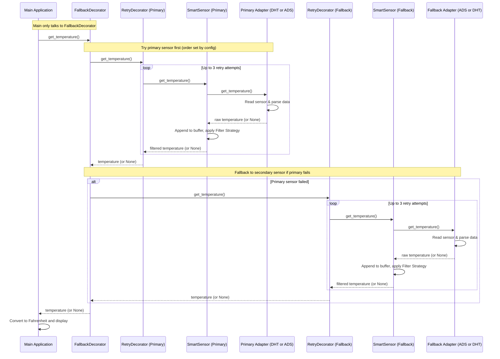

```mermaid
sequenceDiagram
    participant Main as Main Application
    participant FallbackDecorator as FallbackDecorator
    participant RetryA as RetryDecorator (Primary)
    participant SmartA as SmartSensor (Primary)
    participant PrimaryAdapter as Primary Adapter (DHT or ADS)
    participant RetryB as RetryDecorator (Fallback)
    participant SmartB as SmartSensor (Fallback)
    participant FallbackAdapter as Fallback Adapter (ADS or DHT)

    Note over Main,FallbackDecorator: Main only talks to FallbackDecorator
    Main->>FallbackDecorator: get_temperature()

    Note over FallbackDecorator,PrimaryAdapter: Try primary sensor first (order set by config)
    FallbackDecorator->>RetryA: get_temperature()

    loop Up to 3 retry attempts
        RetryA->>SmartA: get_temperature()
        SmartA->>PrimaryAdapter: get_temperature()
        PrimaryAdapter->>PrimaryAdapter: Read sensor & parse data
        PrimaryAdapter-->>SmartA: raw temperature (or None)
        SmartA->>SmartA: Append to buffer, apply Filter Strategy
        SmartA-->>RetryA: filtered temperature (or None)
    end

    RetryA-->>FallbackDecorator: temperature (or None)

    Note over FallbackDecorator,FallbackAdapter: Fallback to secondary sensor if primary fails
    alt Primary sensor failed
        FallbackDecorator->>RetryB: get_temperature()

        loop Up to 3 retry attempts
            RetryB->>SmartB: get_temperature()
            SmartB->>FallbackAdapter: get_temperature()
            FallbackAdapter->>FallbackAdapter: Read sensor & parse data
            FallbackAdapter-->>SmartB: raw temperature (or None)
            SmartB->>SmartB: Append to buffer, apply Filter Strategy
            SmartB-->>RetryB: filtered temperature (or None)
        end

        RetryB-->>FallbackDecorator: temperature (or None)
    end

    FallbackDecorator-->>Main: temperature (or None)

    Main->>Main: Convert to Fahrenheit and display
```
