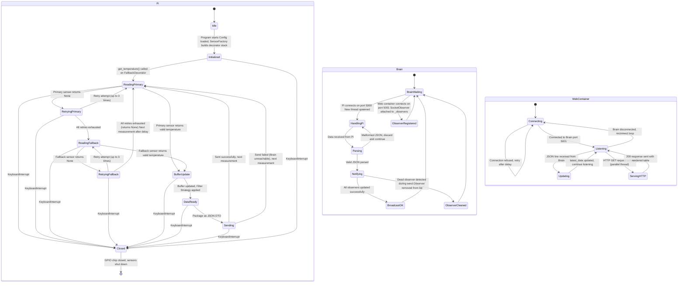

```mermaid
stateDiagram-v2


    %% Raspberry Pi states (sensor reading loop)
 state Pi {
    [*] --> Idle

    Idle --> Initialized : Program starts Config loaded, SensorFactory builds decorator stack

    Initialized --> ReadingPrimary : get_temperature() called on FallbackDecorator

    ReadingPrimary --> RetryingPrimary : Primary sensor returns None
    RetryingPrimary --> ReadingPrimary : Retry attempt (up to 3 times)
    RetryingPrimary --> ReadingFallback : All retries exhausted

    ReadingPrimary --> BufferUpdate : Primary sensor returns valid temperature
    BufferUpdate --> DataReady : Buffer updated, Filter Strategy applied

    ReadingFallback --> RetryingFallback : Fallback sensor returns None
    RetryingFallback --> ReadingFallback : Retry attempt (up to 3 times)

    ReadingFallback --> BufferUpdate : Fallback sensor returns valid temperature
    RetryingFallback --> ReadingPrimary : All retries exhausted (returns None) Next measurement after delay

    DataReady --> Sending : Package as JSON DTO
    Sending --> ReadingPrimary : Sent successfully, next measurement
    Sending --> ReadingPrimary : Send failed (Brain unreachable), next measurement

    ReadingPrimary --> Closed : KeyboardInterrupt
    RetryingPrimary --> Closed : KeyboardInterrupt
    ReadingFallback --> Closed : KeyboardInterrupt
    RetryingFallback --> Closed : KeyboardInterrupt
    BufferUpdate --> Closed : KeyboardInterrupt
    DataReady --> Closed : KeyboardInterrupt
    Sending --> Closed : KeyboardInterrupt
    Initialized --> Closed : KeyboardInterrupt

    Closed --> [*] : GPIO chip closed, sensors shut down


 }
    %% Brain states


    state Brain {
        [*] --> BrainWaiting

        BrainWaiting --> HandlingPi : Pi connects on port 5000 New thread spawned

        HandlingPi --> Parsing : Data received from Pi
        Parsing --> Notifying : Valid JSON parsed
        Parsing --> HandlingPi : Malformed JSON, discard and continue

        Notifying --> BroadcastOK : All observers updated successfully
        Notifying --> ObserverCleaned : Dead observer detected during send Observer removed from list
        BroadcastOK --> BrainWaiting
        ObserverCleaned --> BrainWaiting

        BrainWaiting --> ObserverRegistered : Web container connects on port 5001 SocketObserver attached to _observers
        ObserverRegistered --> BrainWaiting
    }


    %% Web Container  states


    state WebContainer {
        [*] --> Connecting

        Connecting --> Listening : Connected to Brain port 5001
        Connecting --> Connecting : Connection refused, retry after delay

        Listening --> Updating : JSON line received from Brain
        Updating --> Listening : latest_data updated, continue listening

        Listening --> Connecting : Brain disconnected, reconnect loop

        Listening --> ServingHTTP : HTTP GET request arrives (parallel thread)
        ServingHTTP --> Listening : 200 response sent with rendered table
    }
```
