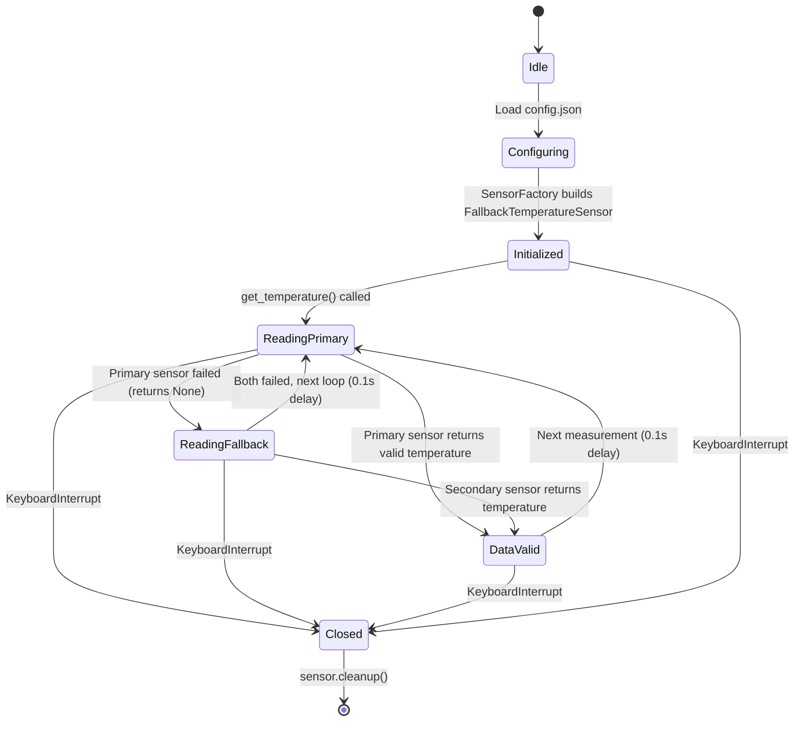

```mermaid
stateDiagram-v2
    [*] --> Idle

    Idle --> Configuring : Load config.json

    Configuring --> Initialized : SensorFactory builds FallbackTemperatureSensor

    Initialized --> ReadingPrimary : get_temperature() called

    ReadingPrimary --> DataValid : Primary sensor returns valid temperature

    ReadingPrimary --> ReadingFallback : Primary sensor failed (returns None)

    ReadingFallback --> DataValid : Secondary sensor returns temperature

    ReadingFallback --> ReadingPrimary : Both failed, next loop (0.1s delay)

    DataValid --> ReadingPrimary : Next measurement (0.1s delay)

    ReadingPrimary --> Closed : KeyboardInterrupt
    ReadingFallback --> Closed : KeyboardInterrupt
    DataValid --> Closed : KeyboardInterrupt
    Initialized --> Closed : KeyboardInterrupt

    Closed --> [*] : sensor.cleanup()
```
