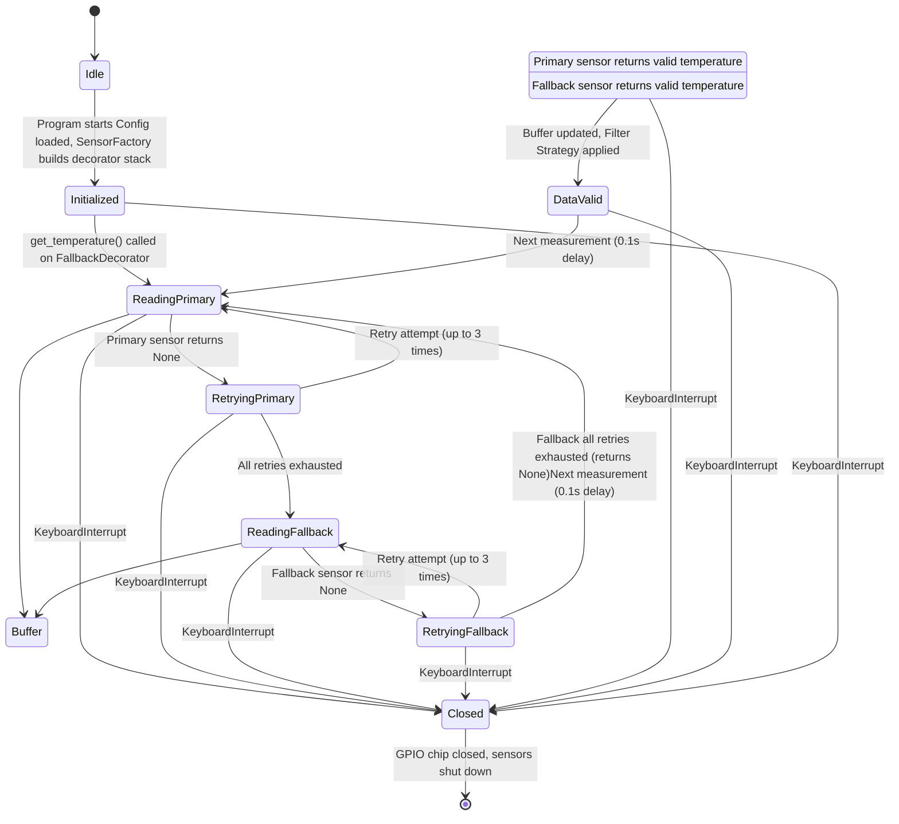

```mermaid
stateDiagram-v2
    [*] --> Idle

    Idle --> Initialized : Program starts Config loaded, SensorFactory builds decorator stack

    %% First we try to read the primary sensor (order set by config)
    Initialized --> ReadingPrimary : get_temperature() called on FallbackDecorator

    %% RetryDecorator attempts up to 3 times before giving up
    ReadingPrimary --> RetryingPrimary : Primary sensor returns None
    RetryingPrimary --> ReadingPrimary : Retry attempt (up to 3 times)

    %% If all retries fail, FallbackDecorator moves to secondary sensor
    RetryingPrimary --> ReadingFallback : All retries exhausted

    %% Primary sensor got a valid reading, SmartSensor buffers and filters it
    ReadingPrimary --> Buffer list : Primary sensor returns valid temperature
    Buffer list --> DataValid : Buffer updated, Filter Strategy applied

    %% Fallback sensor also gets up to 3 retries
    ReadingFallback --> RetryingFallback : Fallback sensor returns None
    RetryingFallback --> ReadingFallback : Retry attempt (up to 3 times)

    %% Fallback sensor got a valid reading, SmartSensor buffers and filters it
    ReadingFallback --> Buffer list : Fallback sensor returns valid temperature

    %% If fallback also exhausts all retries, returns None and main loop retries next tick
    RetryingFallback --> ReadingPrimary : Fallback all retries exhausted (returns None)Next measurement (0.1s delay)

    %% Each temperature reading in loop will first try primary sensor
    DataValid --> ReadingPrimary : Next measurement (0.1s delay)

    %% Because all sensor reading happens in a True loop, KeyboardInterrupt could happen at any step
    ReadingPrimary --> Closed : KeyboardInterrupt
    RetryingPrimary --> Closed : KeyboardInterrupt
    ReadingFallback --> Closed : KeyboardInterrupt
    RetryingFallback --> Closed : KeyboardInterrupt
    Buffer list --> Closed : KeyboardInterrupt
    DataValid --> Closed : KeyboardInterrupt
    Initialized --> Closed : KeyboardInterrupt

    Closed --> [*] : GPIO chip closed, sensors shut down

```
