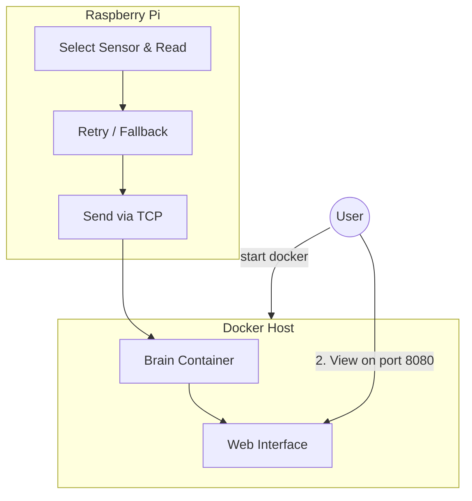

```mermaid
flowchart TD
    subgraph DOCKER [Docker Host]
        BRAIN[Brain Container]
        WEB[Web Interface]
    end

    %% User Actions
    USER((User)) -->|start docker| DOCKER
    USER -->|2. View on port 8080| WEB

    %% Pi Logic
    subgraph PI [Raspberry Pi]
        SENSE[Select Sensor & Read]
        RETRY[Retry / Fallback]
        SEND[Send via TCP]

        SENSE --> RETRY --> SEND
    end

    %% Connection
    SEND --> BRAIN
    BRAIN --> WEB
```
